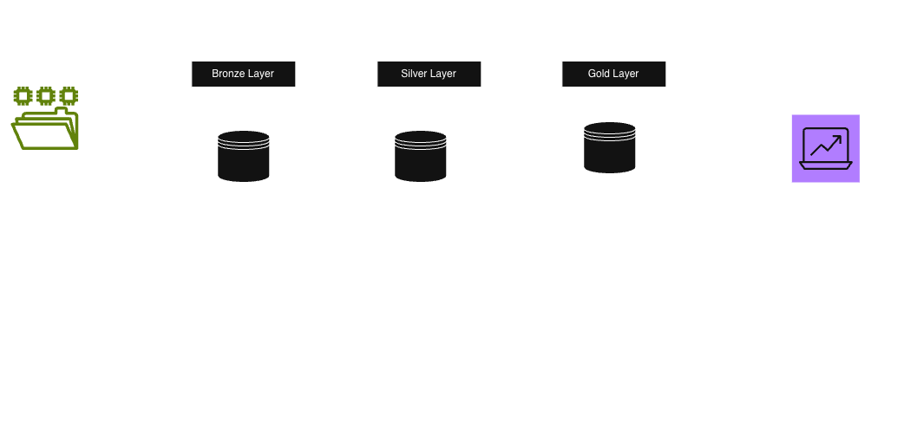
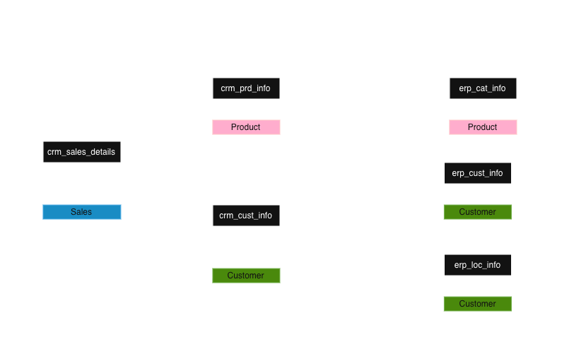
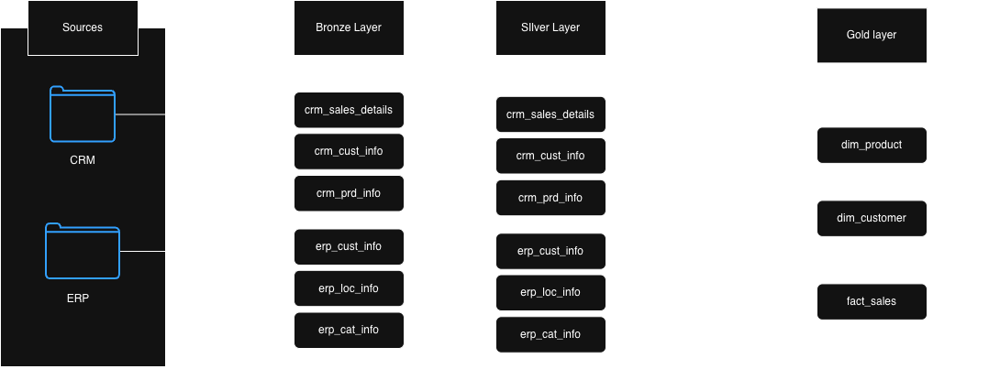
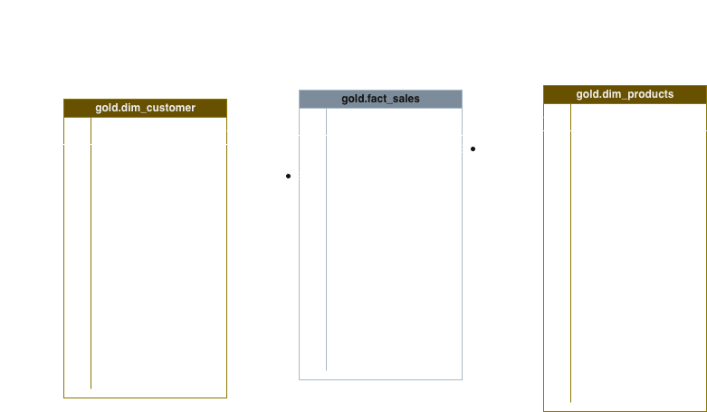

# Data Warehouse and Analytics Project

A simple data warehouse using CSV source data from CRM and ERP systems. The workflow follows the medallion architecture approach:

- Bronze: raw ingested data
- Silver: cleaned and standardized data
- Gold: business ready analytical tables

## Project goal

The goal is to load source files into a warehouse, clean and transform the data, and create gold tables that can support analytics and reporting.

## Architecture overview

## Integration model

## Data flow

1. Load raw CSV files into the bronze layer
2. Clean and normalize data in the silver layer
3. Build final analytical tables in the gold layer
4. Use the gold tables for dashboards and reporting

## Repository structure

- `datasets/` — source CSV files from CRM and ERP
- `scripts/bronze/` — bronze table creation and raw file load scripts
- `scripts/silver/` — cleaning and transformation scripts
- `scripts/gold/` — analytic gold layer scripts
- `docs/` — documentation and data catalog
- `Images/` — architecture and schema diagrams

## Layer view

## Star schema view

## Gold layer summary

The gold layer consists of analytical tables such as:

- `gold.dim_customers`
- `gold.dim_products`
- `gold.fact_sales`

These are designed for reporting, KPI analysis, and BI consumption.

## Notes

This project is intended as a learning and demonstration warehouse implementation using PostgreSQL-friendly SQL patterns.

